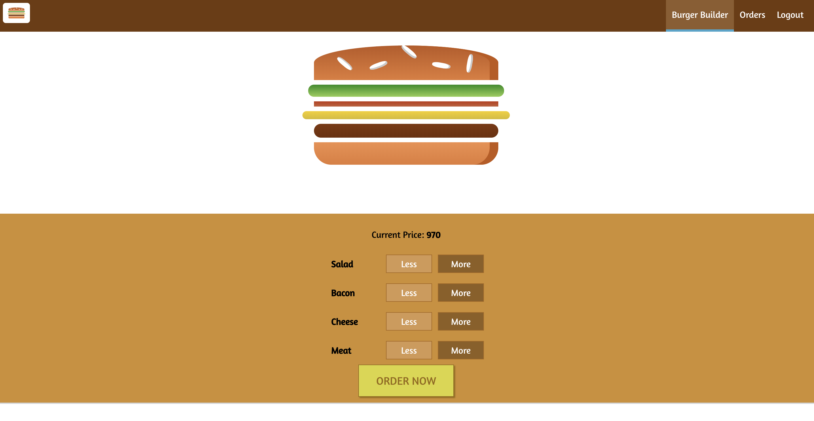
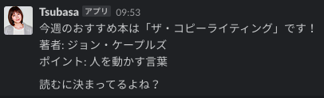

## (人生初) 掲示板

### 概要

PythonのWebフレームワークであるDjangoを使用して作った掲示板アプリです。
記事のCRUD、ユーザー登録、S3への画像アップロード等の基本的な掲示板の機能は使用できます。

### 経緯

ものを作りながら勉強することでより開発方法が理解できること、またある程度実用性のあるものを目指し作成しました。また掲示板アプリであれば、サーバーサイドの通信の仕組み、RDBの設計、ルーティング、デザインパターン、CRUD、認証機能、フロントエンドデザイン等のWeb開発では必須の技術を網羅的に学習できることも期待していました。

### 使用技術

#### Backend

- Django：CRUD、ORM、URLルーティング、テンプレートエンジン(Jinja)、Authentication
- django-markdown：Markdown parser
- Docker：開発環境の構築、Docker Composeを利用しDjangoコンテナとPostgresQLコンテナを接続し使用
- PostgresQL：開発と本番環境でのデータベース
- AWS S3：画像ファイルの配信
- Heroku：デプロイ、アプリケーションの運用

#### Frontend

- Bootstrap：Modalとレスポンシブなコンポーネントデザイン
- Masonry.js：ホーム画面のグリッドデザイン
- highlight.js：記事内のコードハイライト

[App](https://kudolog.herokuapp.com/) | [Github repo](https://github.com/Kudoas/KudoLog)

## オーダーメイドのハンバーガーを注文できるデモアプリ

### 概要

React.js、Redux、Firebaseを用いたオーダーメードのハンバーガーを注文するアプリケーションです。
ユーザー登録、認証、注文追加、注文一覧表示等の機能が利用できます。

### 経緯

上記の掲示板アプリを踏まえ、フロントをHTML、CSSだけではなく何らかのモダンなライブラリを使用したいと考えていた。そこで、フロントエンドの技術の勉強を兼ねて作成した。

### 使用技術

- React.js
- Redux
- Styled Component
- Responsive Design
- Firebase (Hosting, Realtime Database, Auth)

[App](https://react-my-burger-b6f23.firebaseapp.com/) | [Github repo](https://github.com/Kudoas/burger-builder)

## 積読管理用slackボット

### 概要

Google Spread Sheetにまとめたデータからランダムに本をレコメンドしてくれるslack botです。レコメンドする本はGoogle Spread Sheetにまとめており、そこからランダムに選択されます。

### 目的

溜まっている書籍を消化するため、週に1回本をレコメンドしてくれるslack botを作成しました。

### 使用技術

- TypeScript, Google App Script
- Slack Incoming Webhooks bot
- Google Spread Sheet
- gas-clasp-starter

[Github repo](https://github.com/Kudoas/book-recommendation-bot)
