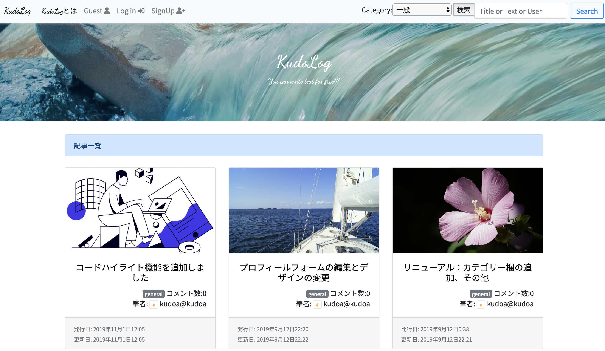

### 掲示板アプリ

PythonのWebフレームワークであるDjangoを使用して作った掲示板アプリです。
記事のCRUD、ユーザー登録、S3への画像アップロード等の基本的な掲示板の機能は使用できます。

[App](https://kudolog.herokuapp.com/) | [Github repo](https://github.com/Kudoas/KudoLog)

### バーガービルダー

React.js、Redux、Firebaseを用いたオーダーメードのハンバーガーを注文するアプリケーションです。
ユーザー登録、認証、注文追加、注文一覧表示等の機能が利用できます。

[App](https://react-my-burger-b6f23.firebaseapp.com/) | [Github repo](https://github.com/Kudoas/burger-builder)
